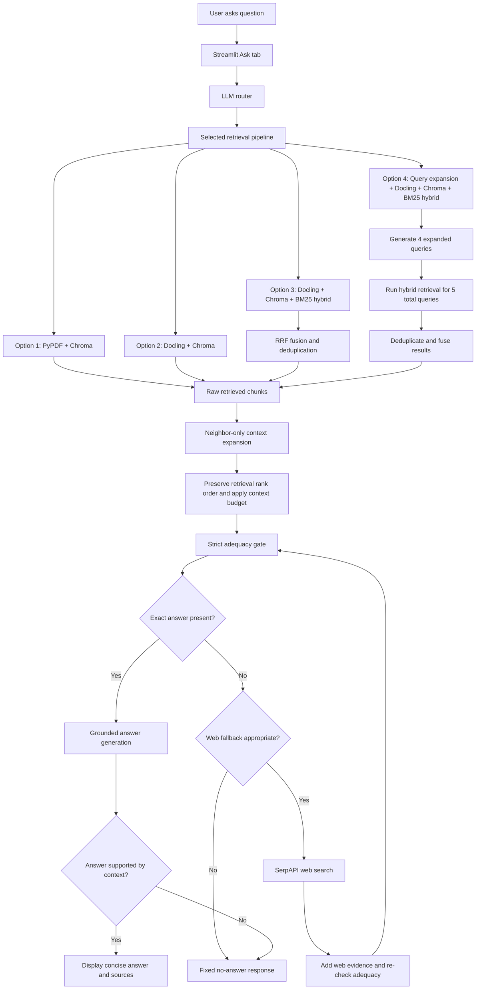
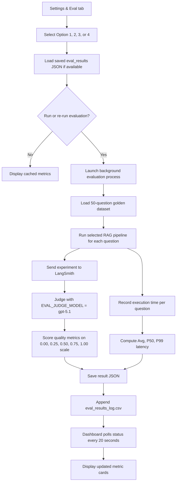

# Cobb County Building and Fire Codes RAG Flow Logic

This document describes the current application flow in diagram-ready language. It is intended to support building a flow chart for the Streamlit Agentic RAG app.

## High-Level Purpose

The app answers questions about Cobb County, Georgia building and fire code materials. It prioritizes local indexed PDF evidence, uses a lightweight LLM router to decide whether current web verification may be needed, and falls back to SerpAPI web search when local evidence is weak, incomplete, or likely outdated.

The current design is intentionally conservative. The agent only answers when the supplied context explicitly supports the user question. If the exact required evidence is missing, the app returns the fixed no-answer response:

```text
I could not find a reliable answer in the available documents or web sources.
```

## Retrieval Configurations

| Option | UI Label | Internal Collection or Slug | Core Retrieval Strategy |
|---|---|---|---|
| 1 | Option 1: PyPDF + Chromadb | `cobb_code_docs_original` / `pypdf_chroma` | PyPDF/LangChain PDF extraction plus Chroma vector search |
| 2 | Option 2: Docling + Chromadb | `cobb_code_docs_docling` / `docling_chroma` | Docling layout-aware parsing plus Chroma vector search |
| 3 | Option 3: Docling + Chroma + BM25 Hybrid Search | `docling_chroma_bm25_hybrid` | Docling chunks retrieved with Chroma vector search and local BM25 keyword search, then fused |
| 4 | Option 4: Docling + Chroma + Query Expansion + BM25 Hybrid Search | `docling_chroma_bm25_expansion` | Option 3 hybrid retrieval plus LLM query expansion before retrieval |

Default retrieval depth:

- `RETRIEVER_K=10`
- Options 1 and 2 return the top Chroma results.
- Option 3 fuses Chroma and BM25 results, then keeps the top `RETRIEVER_K`.
- Option 4 expands the original query into five total queries, retrieves hybrid results for each, deduplicates, fuses, then keeps the top `RETRIEVER_K`.

## Main User-Facing Flow

### Step 1: User Opens Streamlit App

- User lands on the Streamlit interface.
- The app shows three main tabs:
  - Ask
  - Settings & Eval
  - About the App

### Step 2: User Selects Retrieval Configuration

- In the Settings & Eval tab, the user selects one of the four retrieval options.
- The selected option is stored in Streamlit session state.
- New questions use the selected retrieval pipeline without restarting the app.

### Step 3: User Asks a Question

- User enters a Cobb County building or fire code question in the Ask tab.
- The app appends the question to the chat history.
- The app passes the question to the RAG agent.

### Step 4: Lightweight LLM Router Classifies Query

The router reviews the user question and decides whether the workflow should use:

- local document retrieval
- web search
- both local retrieval and web search

Signals that can favor web verification:

- The user asks for current, latest, today, adopted, effective, or active requirements.
- The question involves fee schedules, current code editions, or recently changing rules.
- Local documents may be stale or incomplete.

Local retrieval still remains the primary evidence source for Cobb County document questions.

## Retrieval Option Branches

### Option 1: PyPDF + Chromadb

Flow:

1. Query is embedded using `OPENAI_EMBEDDING_MODEL`, currently `text-embedding-3-small`.
2. Chroma searches the `cobb_code_docs_original` collection.
3. Top local chunks are returned with metadata.
4. Sources include file path, page number when available, chunk index, and relevance score.
5. Retrieved chunks are expanded with same-document neighboring chunks only.

Best for:

- Preserving the original app behavior.
- Simple PDF text extraction.
- Baseline comparison against Docling and hybrid retrieval.

### Option 2: Docling + Chromadb

Flow:

1. Query is embedded using the same embedding model.
2. Chroma searches the `cobb_code_docs_docling` collection.
3. Retrieved chunks come only from Docling-generated text and Docling metadata.
4. Sources include file, parser/backend, chunk index, and available page or section metadata.
5. Retrieved chunks are expanded with same-document Docling neighboring chunks only.

Important constraint:

- Docling modes do not use PyPDF fallback content.
- Docling modes do not use full-page or page-level expansion.
- If Docling failed to parse a document during ingestion, that document is not silently replaced with PyPDF text in the Docling index.

Best for:

- Layout-heavy PDFs.
- Tables, headings, sections, and regulatory formatting.
- Comparing document parsing quality against Option 1.

### Option 3: Docling + Chroma + BM25 Hybrid Search

Flow:

1. Query is sent to Docling Chroma vector retrieval.
2. Query is also sent to a local BM25 keyword corpus.
3. BM25 retrieves a larger keyword candidate pool.
4. Vector and keyword results are combined with Reciprocal Rank Fusion.
5. Duplicates are removed.
6. Final top `RETRIEVER_K` chunks are passed to deterministic neighbor expansion.

Default retrieval behavior:

- BM25 candidate pool uses `max(RETRIEVER_K * 4, 20)`.
- Dense candidates come from Chroma.
- Reciprocal Rank Fusion combines dense and keyword rankings.
- Final answer context starts from the top `RETRIEVER_K` fused chunks.

Best for:

- Keyword-heavy code questions.
- Exact section references.
- Regulatory phrases where BM25 can complement semantic retrieval.

### Option 4: Docling + Chroma + Query Expansion + BM25 Hybrid Search

Flow:

1. Original user question is sent to a dedicated LLM query-expansion prompt.
2. The expansion step creates four additional retrieval queries.
3. Total retrieval queries:
   - 1 original query
   - 4 expanded technical or step-back queries
4. Each query runs through the Option 3 hybrid retrieval process.
5. Results across all five queries are deduplicated.
6. A second fusion pass ranks the combined results.
7. Final top `RETRIEVER_K` chunks are passed to deterministic neighbor expansion.

Default retrieval behavior:

- Each expanded query retrieves up to `RETRIEVER_K * 2` chunks.
- Results are deduplicated across the five query result sets.
- Final answer context keeps the top `RETRIEVER_K` fused chunks.

Best for:

- Underspecified questions.
- Questions where terminology may vary across documents.
- Questions needing broader recall.

Tradeoff:

- Adds one extra LLM call for query expansion.
- Latency metrics include this expansion call.

## Deterministic Context Expansion

Context expansion runs after initial retrieval or reranking and before the adequacy gate.

Current behavior:

- `CONTEXT_EXPANSION_ENABLED=true`
- `CONTEXT_EXPANSION_MODE=neighbors`
- `CONTEXT_NEIGHBOR_WINDOW=1`
- `CONTEXT_MAX_EXPANDED_DOCS=8`
- `CONTEXT_MAX_CHARS=18000`

Expansion rule:

For each retrieved chunk, the app attempts to add:

- previous same-document chunk: `chunk_index - 1`
- retrieved chunk: `chunk_index`
- next same-document chunk: `chunk_index + 1`

Important ordering rules:

- Raw retrieval priority is preserved globally.
- Expanded groups are processed in original retrieval rank order.
- Within each retrieved group, chunks are ordered by chunk index.
- The app does not globally sort expanded chunks by source, page, or document name.
- The context budget is applied after retrieval-priority ordering.
- Lower-ranked expanded groups are trimmed before higher-ranked retrieved hits.

Important constraints:

- No page-based expansion is used.
- No full-page context is used.
- No `*_pages.jsonl` context stores are used.
- Context sidecars contain chunk records only.
- If `chunk_index` or a chunk sidecar is missing, the app keeps the retrieved chunk and logs that neighbor expansion was skipped.
- In Docling modes, expansion only uses Docling-generated chunks with matching source/backend/parser metadata.

The goal is to reduce false refusals caused by chunk boundaries without allowing long lower-ranked pages or unrelated documents to push higher-ranked evidence out of the context budget.

## Evidence Adequacy Gate

The current flow is:

1. retrieve top-k chunks
2. expand with same-document neighboring chunks only
3. deduplicate while preserving retrieval-rank order
4. apply context budget
5. run the adequacy gate
6. generate answer only if evidence is adequate

The adequacy gate is a strict evidence sufficiency checker. It does not answer the user question. It decides whether the supplied evidence contains the exact fact needed to answer.

Gate behavior:

- Uses only the supplied evidence.
- Does not use memory, prior conversation, outside knowledge, common code knowledge, or likely values.
- For numeric, dimensional, code, inspection, permit, fee, date, or procedural questions, it returns answerable only if the exact value or exact requirement appears in the evidence.
- If the evidence is related but incomplete, vague, or missing the exact requested fact, the gate fails.
- If the gate fails, the agent returns the fixed no-answer response.

The gate returns structured JSON with:

- `answerable`
- `required_fact`
- `supporting_quote`
- `source_id`

## Web Fallback Flow

If local evidence is weak, incomplete, or current-code verification is needed:

1. The app runs SerpAPI Google Search.
2. Web snippets and URLs are added to the evidence context.
3. The adequacy and answer-generation rules remain strict.
4. Web results must explicitly support the answer.

If web evidence is still insufficient, the app returns the same fixed no-answer response.

## Answer Generation Flow

The final LLM receives:

- original user question
- expanded local contexts
- web search context if used
- runtime context such as the current date
- source metadata
- strict instructions to answer only from supplied context

Runtime answer model:

- `OPENAI_MODEL=gpt-4.1-mini`

Embedding model:

- `OPENAI_EMBEDDING_MODEL=text-embedding-3-small`

Response rules:

- Use only the supplied local document excerpts, web results, and runtime context.
- Do not use memory, prior conversation turns, general code knowledge, outside assumptions, likely values, or common construction practice.
- Every factual claim must be directly supported by the supplied context.
- Do not state thresholds, dates, dimensions, distances, heights, fire ratings, fees, code sections, exceptions, inspection requirements, permit requirements, procedural steps, responsible offices, deadlines, forms, penalties, or approval conditions unless they appear explicitly in the supplied context.
- Keep the answer to 2-3 short paragraphs maximum.
- Include source names, local source IDs, or URLs inline when available.
- If refusing due to insufficient evidence, output only the fixed no-answer sentence.

## Chat UI Display Flow

The Ask tab displays:

- selected retrieval backend
- chat input above the Clear chat button
- user question
- assistant answer
- answer source label:
  - local documents
  - web search
  - local documents + web search
  - error if applicable
- expandable source list
- most recent conversations above older conversations

## Ingestion and Index Build Flow

### Step 1: Source PDFs

- Source documents are stored under `data/`.
- PDFs may be organized in subfolders.

### Step 2: Select Ingestion Pipeline

The ingestion script supports pipeline slugs:

```bash
python -m src.ingestion --rebuild --pipeline pypdf_chroma
python -m src.ingestion --rebuild --pipeline docling_chroma
python -m src.ingestion --rebuild --pipeline docling_chroma_bm25_hybrid
python -m src.ingestion --rebuild --pipeline docling_chroma_bm25_expansion
python -m src.ingestion --rebuild --pipeline all
```

Important:

- Option 4 does not create a separate physical index.
- Option 4 reuses the Option 3 Docling Chroma collection and BM25 corpus.
- Query expansion happens at retrieval time, not ingestion time.

### Step 3: Parse PDFs

Option 1:

- Uses PyPDF/LangChain PDF loading.
- Extracts page text from PDFs.
- Stores PyPDF chunks in the original Chroma collection.

Options 2, 3, and 4:

- Use Docling for layout-aware PDF parsing.
- Docling exports cleaner structured text or Markdown.
- Docling modes do not silently substitute PyPDF fallback content.
- Large PDFs can be processed by internal bookmarks, table-of-contents ranges, or overlapping page windows during ingestion, but runtime retrieval does not use page expansion.

### Step 4: Chunk Text

Chunking uses environment settings:

- `CHUNK_SIZE`
- `CHUNK_OVERLAP`

Chunks retain metadata such as:

- source file
- normalized `doc_id`
- page number or page range when available
- `chunk_index`
- parser/backend type
- stable chunk key when available

### Step 5: Embed Chunks

Embedding model:

- `OPENAI_EMBEDDING_MODEL=text-embedding-3-small`

Changing runtime LLM or evaluator model does not require rebuilding embeddings.

Rebuild embeddings only when:

- source PDFs change
- chunking settings change
- parser pipeline changes
- embedding model changes
- Chroma vectorstore or BM25 corpus needs to be regenerated

### Step 6: Persist Search Assets

Option 1:

- Chroma collection: `cobb_code_docs_original`
- chunk sidecar: `context_store/pypdf_chroma_chunks.jsonl`

Option 2:

- Chroma collection: `cobb_code_docs_docling`
- chunk sidecar: `context_store/docling_chroma_chunks.jsonl`

Option 3:

- Chroma collection for Docling chunks
- BM25 corpus under `bm25_index/`
- chunk sidecar: `context_store/docling_chroma_bm25_hybrid_chunks.jsonl`

Option 4:

- reuses Option 3 physical indexes
- chunk sidecar: `context_store/docling_chroma_bm25_expansion_chunks.jsonl`

Context store note:

- Current context stores are chunk-only JSONL files.
- Page-level context stores are intentionally not used.

## Settings & Eval Flow

### Step 1: User Opens Settings & Eval

The dashboard shows:

- retrieval configuration radio buttons arranged vertically
- selected pipeline explanation
- saved metrics if available
- evaluation status if a run is active
- Run Evaluation Metrics or Re-run Evaluation button

### Step 2: Load Saved Results

The app checks `eval_results/` for saved JSON:

| Option | Result File |
|---|---|
| Option 1 | `eval_results/pypdf_chroma_results.json` |
| Option 2 | `eval_results/docling_chroma_results.json` |
| Option 3 | `eval_results/docling_chroma_bm25_hybrid_results.json` |
| Option 4 | `eval_results/docling_chroma_bm25_expansion_results.json` |

### Step 3: Run Evaluation

When the user clicks Run or Re-run:

1. Streamlit launches a background Python evaluation process.
2. The app writes status updates under `eval_status/`.
3. The dashboard polls status every 20 seconds while evaluation is running.
4. The background process runs the selected RAG configuration against the fixed golden dataset.

Golden dataset:

```text
eval_testset/cobb_county_testset.csv
```

Dataset size:

- 50 questions

Question types:

- simple lookup
- reasoning
- multi-context synthesis
- procedural or scenario-based questions

### Step 4: LangSmith Scoring

The evaluation uses LangSmith experiments.

Evaluator judge model:

- `EVAL_JUDGE_MODEL=gpt-5.1`

Evaluator delay and retry controls:

- `EVAL_JUDGE_DELAY_SECONDS`
- `EVAL_JUDGE_MAX_RETRIES`

Quality metrics:

- Faithfulness
- Answer relevance
- Context precision
- Context recall

Latency metrics:

- Average latency
- P50 latency
- P99 latency

### Step 5: Five-Point Quality Scoring

The quality evaluators use a five-point scale:

```text
0.00, 0.25, 0.50, 0.75, 1.00
```

Faithfulness evaluator behavior:

- Receives the question, answer, and context.
- Extracts factual claims from the answer.
- Checks each claim against the context only.
- Is strict for numerical values, dimensions, dates, fire ratings, fees, code sections, exceptions, permit requirements, and inspection procedures.
- Treats a conservative no-answer response as faithful when the context lacks the exact requested fact.
- Penalizes a no-answer response when the context clearly contains the exact requested answer.

Other evaluator behavior:

- Answer relevance scores how directly the answer addresses the user's question.
- Context precision scores the signal-to-noise ratio of retrieved context.
- Context recall scores whether the retrieved context contains the facts needed for the reference answer.

### Step 6: Persist Evaluation Results

When evaluation completes:

- result JSON is saved under `eval_results/`
- status JSON is updated under `eval_status/`
- summary row is appended to:

```text
eval_results/eval_results_log.csv
```

### Step 7: Dashboard Displays Metrics

The Settings & Eval tab displays:

- four quality metric cards
- one latency card showing:

```text
Avg | P50 | P99
```

Metric cards are color coded:

- green: strong
- dark yellow: moderate
- red: needs attention

## Diagram-Ready Node List

### User Interface Nodes

- User opens Streamlit app
- User selects retrieval configuration
- User asks question
- App displays answer and sources
- User opens Settings & Eval
- User runs evaluation

### Runtime Agent Nodes

- Receive user question
- LLM router classifies query
- Selected retrieval pipeline runs
- Deterministic neighbor context expansion
- Strict adequacy gate
- SerpAPI web fallback if needed
- Grounded answer generation
- Source formatting
- Conservative fallback if no reliable evidence

### Retrieval Backend Nodes

- Option 1: PyPDF Chroma vector retrieval
- Option 2: Docling Chroma vector retrieval
- Option 3: Docling Chroma vector retrieval
- Option 3: Local BM25 keyword retrieval
- Option 3: Reciprocal Rank Fusion
- Option 4: LLM query expansion
- Option 4: Multi-query hybrid retrieval
- Option 4: Deduplication and second fusion pass
- Neighbor expansion using `chunk_index - 1`, current chunk, and `chunk_index + 1`

### Evaluation Nodes

- Load 50-question golden dataset
- Launch background evaluator
- Run selected RAG pipeline on each question
- Send runs to LangSmith
- Judge with GPT-5.1
- Apply five-point quality scoring
- Compute latency metrics
- Save result JSON
- Append metric log CSV
- Refresh dashboard metrics

## Runtime Mermaid Draft



## Evaluation Mermaid Draft


