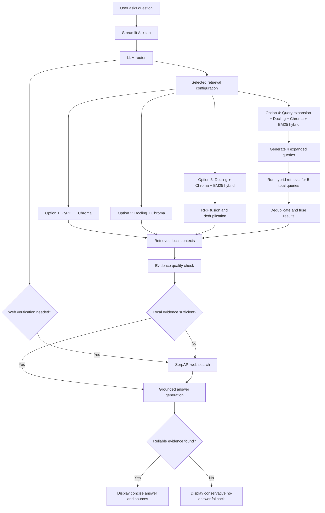

# Cobb County Building and Fire Codes RAG Flow Logic

This document describes the application flow in diagram-ready language. It is intended to support building a flow chart for the Streamlit Agentic RAG app.

## High-Level Purpose

The app answers questions about Cobb County, Georgia building and fire code materials. It prioritizes local indexed PDF evidence, uses an LLM router to decide whether web verification may be needed, and falls back to SerpAPI web search when local evidence is weak, incomplete, or likely outdated.

The app includes four retrieval configurations:

| Option | UI Label | Internal Collection or Slug | Core Retrieval Strategy |
|---|---|---|---|
| 1 | Option 1: PyPDF + Chromadb | `cobb_code_docs_original` / `pypdf_chroma` | PyPDF/LangChain PDF extraction plus Chroma vector search |
| 2 | Option 2: Docling + Chromadb | `cobb_code_docs_docling` / `docling_chroma` | Docling layout-aware parsing plus Chroma vector search |
| 3 | Option 3: Docling + Chroma + BM25 Hybrid Search | `docling_chroma_bm25_hybrid` | Docling chunks retrieved with both Chroma vector search and local BM25 keyword search, then fused |
| 4 | Option 4: Docling + Chroma + Query Expansion + BM25 Hybrid Search | `docling_chroma_bm25_expansion` | Option 3 hybrid retrieval plus LLM query expansion before retrieval |

## Main User-Facing Flow

### Step 1: User Opens Streamlit App

- User lands on the Streamlit interface.
- The app shows three main tabs:
  - Ask
  - Settings & Eval
  - About the App

### Step 2: User Selects Retrieval Configuration

- In the Settings & Eval tab, the user selects one of four retrieval options.
- The selected option is stored in Streamlit session state.
- New questions use the selected retrieval backend without restarting the app.

### Step 3: User Asks a Question

- User enters a Cobb County building or fire code question in the Ask tab.
- The app appends the question to the chat history.
- The app passes the question to the RAG agent.

### Step 4: Lightweight LLM Router Classifies Query

The router reviews the user question and decides whether the question may require:

- Local document retrieval
- Web search
- Both local retrieval and web search

Typical signals for web verification:

- The user asks for current, latest, today, adopted, effective, or active requirements.
- The question involves dated fee schedules, current code editions, or recently changing rules.
- Local documents may be stale or incomplete.

### Step 5: Local Retrieval Runs First

The selected retrieval option controls how local retrieval happens.

## Retrieval Configuration Branches

### Option 1: PyPDF + Chromadb

Flow:

1. Query is embedded using `OPENAI_EMBEDDING_MODEL`, currently `text-embedding-3-small`.
2. Chroma searches the `cobb_code_docs_original` collection.
3. Top local chunks are returned with metadata.
4. Sources include file path, page number when available, and relevance score.

Best for:

- Preserving the original app behavior.
- Simple PDF text extraction.
- Baseline comparison against Docling and hybrid retrieval.

### Option 2: Docling + Chromadb

Flow:

1. Query is embedded using the same embedding model.
2. Chroma searches the `cobb_code_docs_docling` collection.
3. Retrieved chunks come from Docling-parsed Markdown or structured text.
4. Sources include file, chunk, parser type, and available page or section metadata.

Best for:

- Layout-heavy PDFs.
- Tables, headings, sections, and regulatory formatting.
- Comparing document parsing quality against Option 1.

### Option 3: Docling + Chroma + BM25 Hybrid Search

Flow:

1. Query is sent to Docling Chroma vector retrieval.
2. Query is also sent to the local BM25 keyword corpus.
3. BM25 retrieves a larger keyword candidate pool.
4. Vector and keyword results are combined with Reciprocal Rank Fusion.
5. Duplicates are removed.
6. Final top `RETRIEVER_K` chunks are passed to answer generation.

Default retrieval depth:

- `RETRIEVER_K=10`
- BM25 candidate pool uses `max(RETRIEVER_K * 4, 20)`
- Final answer context keeps the top `RETRIEVER_K` chunks after fusion

Best for:

- Keyword-heavy code questions.
- Exact section references.
- Regulatory phrases where BM25 can complement semantic retrieval.

### Option 4: Docling + Chroma + Query Expansion + BM25 Hybrid Search

Flow:

1. Original user question is sent to an LLM query expansion prompt.
2. The expansion step creates four additional retrieval queries.
3. Total retrieval queries:
   - 1 original query
   - 4 expanded technical or step-back queries
4. Each query runs through the Option 3 hybrid retrieval process.
5. Results across all five queries are deduplicated.
6. A second fusion pass ranks the combined results.
7. Final top `RETRIEVER_K` chunks are passed to answer generation.

Default retrieval depth:

- Each expanded query retrieves up to `RETRIEVER_K * 2` chunks.
- Results are deduplicated across the five query result sets.
- Final answer context keeps the top `RETRIEVER_K` chunks.

Best for:

- Underspecified questions.
- Questions where terminology may vary across documents.
- Questions needing broader recall.

Tradeoff:

- Adds one extra LLM call for query expansion.
- Latency metrics include this expansion call.

## Evidence Quality Decision Flow

### Step 6: Agent Checks Retrieval Quality

The agent evaluates whether local evidence is strong enough.

Evidence is considered stronger when:

- Retrieved chunks have sufficient relevance scores.
- Retrieved content directly answers the user question.
- Sources contain clear supporting text.
- The question does not require current web verification.

Evidence is considered weak or incomplete when:

- Scores are low.
- Retrieved content is off-topic.
- Retrieved content only partially answers the question.
- The question asks for current or effective-date information not clearly supported by local documents.

### Step 7: Web Fallback Decision

If local evidence is sufficient:

- Continue directly to grounded answer generation.

If local evidence is weak, incomplete, or current-code verification is needed:

- Run SerpAPI Google Search.
- Prefer official or authoritative sources when available.
- Add web snippets and URLs to the answer context.

## Answer Generation Flow

### Step 8: Grounded Answer Prompt

The final LLM receives:

- Original user question
- Retrieved local contexts
- Web search context if used
- Source metadata
- Instructions to stay concise and grounded

Runtime model:

- `OPENAI_MODEL=gpt-4.1-mini`

Optional:

- Gemini can be used if configured as the LLM provider.

### Step 9: Response Rules

The generated answer must:

- Be grounded in local documents or web results.
- Avoid unsupported claims.
- Stay within 2-3 paragraphs.
- Include sources when available.
- Clearly state whether the answer came from local documents, web search, or both.

If reliable evidence is not found, the app responds:

```text
I could not find a reliable answer in the available documents or web sources.
```

### Step 10: Display Response in Chat UI

The Ask tab displays:

- User question
- Assistant answer
- Answer source label:
  - local documents
  - web search
  - local documents + web search
  - error if applicable
- Expandable source list
- Most recent conversations above older conversations

## Ingestion and Index Build Flow

### Step 1: Source PDFs

- Source documents are stored under `data/`.
- PDFs may be organized in subfolders.

### Step 2: Select Ingestion Pipeline

The ingestion script supports multiple pipeline slugs:

```bash
python -m src.ingestion --rebuild --pipeline pypdf_chroma
python -m src.ingestion --rebuild --pipeline docling_chroma
python -m src.ingestion --rebuild --pipeline docling_chroma_bm25_hybrid
python -m src.ingestion --rebuild --pipeline docling_chroma_bm25_expansion
python -m src.ingestion --rebuild --pipeline all
```

Important:

- Option 4 does not create a separate physical index.
- Option 4 reuses the Option 3 Docling Chroma collection and BM25 corpus.
- Query expansion happens at retrieval time, not ingestion time.

### Step 3: Parse PDFs

Option 1:

- Uses PyPDF/LangChain PDF loading.
- Extracts page text from PDFs.

Options 2, 3, and 4:

- Use Docling for layout-aware PDF parsing.
- Docling exports cleaner structured text or Markdown.
- Large PDFs can be processed by internal bookmarks, table-of-contents ranges, or overlapping page windows.

### Step 4: Chunk Text

Chunking uses environment settings:

- `CHUNK_SIZE`
- `CHUNK_OVERLAP`

Chunks retain metadata such as:

- Source file
- Page number or page range when available
- Chunk index
- Parser type

### Step 5: Embed Chunks

Embedding model:

- `OPENAI_EMBEDDING_MODEL=text-embedding-3-small`

Changing runtime LLM or evaluator model does not require rebuilding embeddings.

Rebuild embeddings only when:

- Source PDFs change.
- Chunking settings change.
- Parser pipeline changes.
- Embedding model changes.
- Vectorstore or BM25 corpus needs to be regenerated.

### Step 6: Persist Indexes

Option 1:

- Chroma collection: `cobb_code_docs_original`

Option 2:

- Chroma collection: `cobb_code_docs_docling`

Option 3:

- Chroma collection: Docling Chroma corpus
- BM25 corpus file under `bm25_index/`

Option 4:

- Reuses Option 3 physical indexes.
- No separate index is created.

## Settings & Eval Flow

### Step 1: User Opens Settings & Eval

The dashboard shows:

- Retrieval configuration radio buttons
- Selected backend explanation
- Saved metrics if available
- Evaluation status if a run is active
- Run Evaluation Metrics or Re-run Evaluation button

### Step 2: Load Saved Results

The app checks `eval_results/` for saved JSON:

| Option | Result File |
|---|---|
| Option 1 | `eval_results/pypdf_chroma_results.json` |
| Option 2 | `eval_results/docling_chroma_results.json` |
| Option 3 | `eval_results/docling_chroma_bm25_hybrid_results.json` |
| Option 4 | `eval_results/docling_chroma_bm25_expansion_results.json` |

### Step 3: Run Evaluation

When the user clicks Run or Re-run:

1. Streamlit launches a background Python evaluation process.
2. The app writes status updates under `eval_status/`.
3. The dashboard polls status every 20 seconds while evaluation is running.
4. The background process runs the selected RAG configuration against the fixed golden dataset.

Golden dataset:

```text
eval_testset/cobb_county_testset.csv
```

Dataset size:

- 50 questions

Question types:

- Simple lookup
- Reasoning
- Multi-context synthesis

### Step 4: LangSmith Scoring

The evaluation uses LangSmith experiments.

Evaluator judge model:

- `EVAL_JUDGE_MODEL=gpt-5.1`

Evaluator delay and retry controls:

- `EVAL_JUDGE_DELAY_SECONDS`
- `EVAL_JUDGE_MAX_RETRIES`

Metrics:

- Faithfulness
- Answer relevance
- Context precision
- Context recall
- Average latency
- P50 latency
- P99 latency

### Step 5: Persist Evaluation Results

When evaluation completes:

- Result JSON is saved under `eval_results/`.
- Status JSON is updated under `eval_status/`.
- Summary row is appended to:

```text
eval_results/eval_results_log.csv
```

### Step 6: Dashboard Displays Metrics

The Settings & Eval tab displays:

- Four RAGAS-style quality metrics
- One latency card showing:

```text
Avg | P50 | P99
```

Metric cards are color coded:

- Green: strong
- Dark yellow: moderate
- Red: needs attention

## Diagram-Ready Node List

Use these as flow chart nodes.

### User Interface Nodes

- User opens Streamlit app
- User selects retrieval configuration
- User asks question
- App displays answer and sources
- User opens Settings & Eval
- User runs evaluation

### Runtime Agent Nodes

- Receive user question
- LLM router classifies query
- Selected retrieval backend runs
- Local evidence quality check
- Web fallback if needed
- Grounded answer generation
- Source formatting
- Conservative fallback if no reliable evidence

### Retrieval Backend Nodes

- Option 1: PyPDF Chroma vector retrieval
- Option 2: Docling Chroma vector retrieval
- Option 3: Docling Chroma vector retrieval
- Option 3: Local BM25 keyword retrieval
- Option 3: Reciprocal Rank Fusion
- Option 4: LLM query expansion
- Option 4: Multi-query hybrid retrieval
- Option 4: Deduplication and second fusion pass

### Evaluation Nodes

- Load 50-question golden dataset
- Launch background evaluator
- Run selected RAG backend on each question
- Send runs to LangSmith
- Judge with GPT-5.1
- Compute metrics
- Save result JSON
- Append metric log CSV
- Refresh dashboard metrics

## Mermaid Draft



## Evaluation Mermaid Draft


