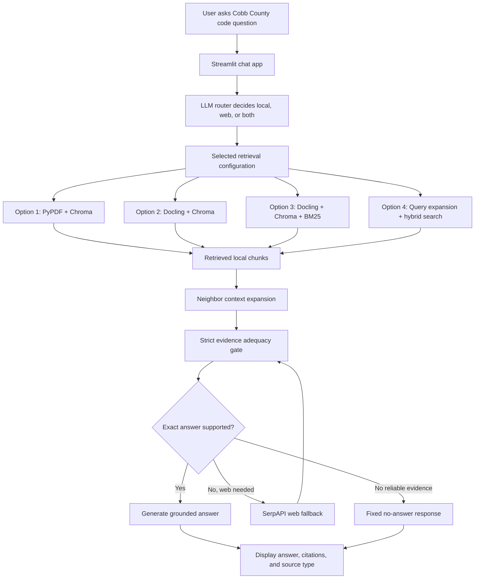

# Cobb County Building and Fire Code Agentic RAG

## High-Level Flowchart Blueprint

Purpose: use this file as a clear, reviewer-friendly guide for creating a presentation flowchart image. The chart should explain what the app does, how a user question moves through the system, and how the four retrieval configurations differ.

Recommended visual style:

- Title: **Cobb County Building and Fire Code Agentic RAG Flowchart**
- Layout: vertical workflow on the left, retrieval option comparison panel on the right
- Audience: non-technical users, recruiters, hiring managers, and technical reviewers
- Tone: simple, polished, evidence-focused, and portfolio-ready

---

## Main Flow

### Layer 1: User Interaction

**Step 1: User Question**

- User asks a natural-language question about Cobb County building or fire code documents.
- Example topics:
  - permits
  - inspections
  - fire code requirements
  - plan review
  - adopted code editions
  - fees or current requirements

**Step 2: Streamlit App**

- Chat interface receives the question.
- Displays the response, sources, and retrieval mode.
- Lets the user choose one of four retrieval configurations in **Settings & Eval**.
- Provides evaluation metrics for each configuration.

---

### Layer 2: Routing and Agent Orchestration

**Step 3: LLM Router**

- A lightweight LLM routing step reviews the question before retrieval and answer generation.
- Determines whether the question should use:
  - local document retrieval
  - web verification
  - both local documents and web verification
- Web verification is most useful for current, latest, effective-date, fee schedule, or recently changing requirements.

**Step 4: LangChain RAG Agent**

- Orchestrates the full workflow.
- Runs the selected retrieval configuration.
- Expands retrieved context using deterministic neighboring chunks.
- Checks whether the retrieved evidence is adequate.
- Uses web search only when needed.
- Generates a grounded answer only when evidence supports it.

---

### Layer 3: Retrieval and Evidence Workflow

**Step 5: Local RAG Retrieval**

- The user question is sent to the selected local retrieval pipeline.
- The app searches indexed Cobb County PDFs.
- Retrieved evidence includes:
  - relevant text chunks
  - file names
  - page or chunk metadata
  - relevance scores
  - source IDs for citation

**Step 6: Neighbor Context Expansion**

- Retrieved chunks are expanded with nearby chunks from the same document.
- The app adds:
  - previous chunk
  - retrieved chunk
  - next chunk
- This helps recover checklist items, table rows, and bullet points that may be split across chunk boundaries.
- The app does **not** use full-page expansion.
- Docling modes do **not** fall back to PyPDF text.

**Step 7: Evidence Adequacy Gate**

- A strict evidence checker decides whether the expanded context contains the exact fact needed to answer.
- For technical details, the exact value must appear in the context.
- The gate is strict for:
  - numbers
  - dimensions
  - dates
  - fees
  - code sections
  - inspection procedures
  - permit requirements
  - approval conditions

**Decision: Is the Exact Answer Supported?**

- If yes: proceed to grounded answer generation.
- If no, and web verification is appropriate: run web fallback.
- If no reliable evidence is found: return the fixed no-answer response.

---

### Layer 4: Web Fallback

**Step 8: SerpAPI Web Search**

- Used when local documents are weak, incomplete, outdated, or the router requests current verification.
- Searches public web sources.
- Prefers official or authoritative sources when available.
- Web evidence is added to the context and checked with the same strict adequacy gate.

---

### Layer 5: Response and Output

**Step 9: Grounded Answer**

- Generates a concise answer using only supplied context.
- Keeps responses to 2-3 short paragraphs.
- Includes source names, local source IDs, or URLs when available.
- Does not use memory, prior conversation, general code knowledge, or assumptions.
- If the exact evidence is missing, the app responds only:

```text
I could not find a reliable answer in the available documents or web sources.
```

**Step 10: Sources and Guardrails**

- Displays citations in the app.
- Shows whether the answer used:
  - local documents
  - web search
  - both
- Enforces conservative guardrails:
  - not legal advice
  - not engineering advice
  - not permitting advice
  - no permit guarantees

---

## Retrieval Configuration Options

Use this section as the right-side comparison table in the flowchart.

| Option | Label | Primary Method | What It Does | Best For |
|---|---|---|---|---|
| 1 | PyPDF + Chromadb | Dense vector search | Uses PyPDF/LangChain extraction, chunks local PDFs, embeds text, and searches with Chroma. | Baseline retrieval and simple PDF text matching |
| 2 | Docling + Chromadb | Layout-aware dense vector search | Uses Docling to parse PDFs into cleaner structured text before chunking, embedding, and Chroma retrieval. | Layout-heavy PDFs, tables, headings, lists, and regulatory documents |
| 3 | Docling + Chroma + BM25 Hybrid Search | Dense vector + keyword search | Combines Docling Chroma semantic retrieval with BM25 keyword retrieval, then fuses rankings using Reciprocal Rank Fusion. | Exact technical terms, code sections, and keyword-heavy regulatory questions |
| 4 | Docling + Chroma + Query Expansion + BM25 Hybrid Search | Multi-query hybrid search | Expands the original question into five total retrieval queries, runs hybrid retrieval for each, deduplicates, and fuses results. | Complex, underspecified, or vocabulary-sensitive questions |

---

## Evaluation and Reliability Layer

This can be shown as a smaller bottom or side panel.

**Settings & Eval Dashboard**

- Lets users switch among the four retrieval options.
- Shows persisted evaluation metrics for each option.
- Runs evaluation against a fixed golden dataset.

**Golden Dataset**

- Stored at `eval_testset/cobb_county_testset.csv`.
- Contains 50 curated questions.
- Covers:
  - simple lookup
  - reasoning
  - multi-context synthesis
  - procedural and scenario-based questions

**Evaluation Metrics**

- Faithfulness: Are answer claims supported by context?
- Answer relevance: Does the answer address the question?
- Context precision: Is retrieved context mostly useful?
- Context recall: Did retrieval include needed facts?
- Latency: Avg, P50, and P99 response time.

**Scoring**

- Quality metrics use a five-point scale:

```text
0.00, 0.25, 0.50, 0.75, 1.00
```

---

## Simplified Diagram Flow



---

## Suggested Flowchart Sections

For a presentation graphic, use five large numbered bands:

1. **User Interaction Layer**
   - User Question
   - Streamlit App

2. **Routing and Agent Orchestration**
   - LLM Router
   - LangChain RAG Agent

3. **Retrieval and Evidence Workflow**
   - Local RAG Retrieval
   - Neighbor Context Expansion
   - Evidence Adequacy Gate

4. **Web Fallback**
   - SerpAPI Web Search
   - Official/authoritative web evidence when local context is insufficient

5. **Response and Output**
   - Grounded Answer
   - Sources and Guardrails

Add a right-side table titled:

```text
Retrieval Configuration Options
```

Add a small bottom ribbon titled:

```text
Reliability and Evaluation
```

Include these keywords in the graphic:

- Local PDFs first
- Four retrieval modes
- Docling parsing
- Chroma vector search
- BM25 hybrid search
- Query expansion
- Neighbor context expansion
- Strict evidence gate
- SerpAPI fallback
- Source-grounded answers
- 50-question golden evaluation set
