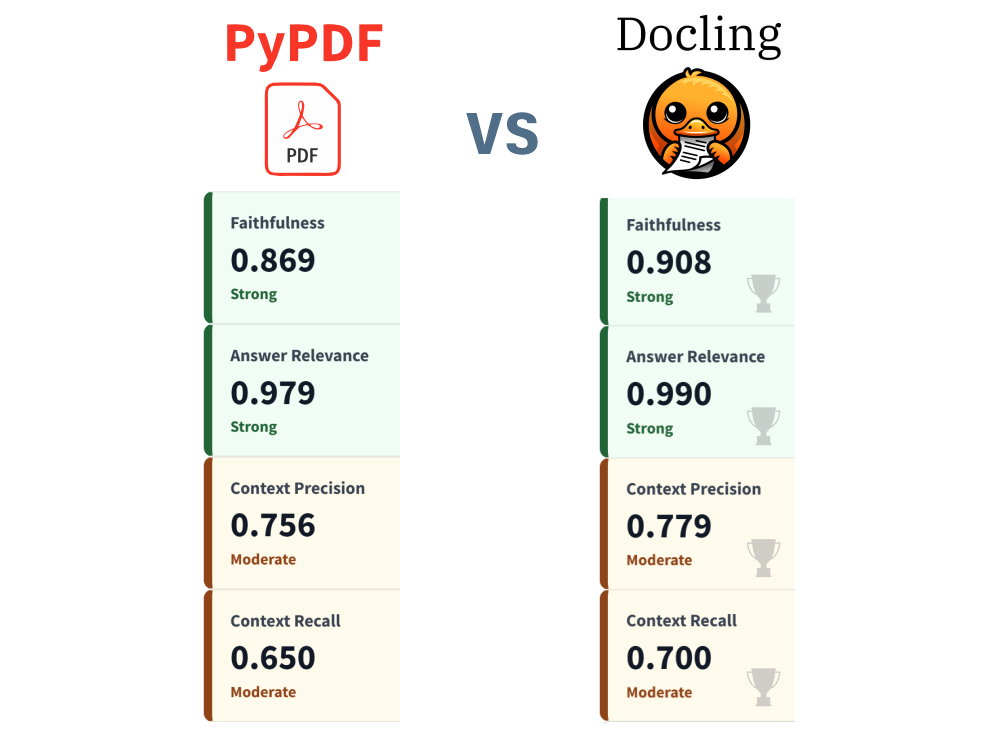

# Cobb County Building & Fire Code Agentic RAG Assistant

Agentic RAG web app that answers Cobb County, Georgia building and fire code questions using local PDF documents first, with web search fallback when local evidence is insufficient or current-code verification is needed.


> Core focus: Retrieval-Augmented Generation, agentic tool use, document indexing, source-grounded answers, and deployable ML application engineering.

---

## Project Highlights

- Task: Agentic Retrieval-Augmented Generation (RAG)
- Domain: Local government building, permitting, and fire code information
- Objective: Help users query complex Cobb County code documents through a simple chat interface
- Retrieval: Chroma vector database over local PDFs
- Document processing: Original PyPDF pipeline plus optional Docling-enhanced parsing
- Agent behavior: Lightweight LLM router, local retrieval, evidence checks, and web fallback when current information is requested
- LLMs: OpenAI by default, optional Google Gemini
- App: Streamlit chat UI with source display, a Settings & Eval dashboard, and an explanatory "About the App" tab
- Deployment: Local Python, Docker Compose, and Streamlit Community Cloud compatible

---

## What This Project Does

Building and fire code information is often spread across ordinances, county PDFs, checklists, permit forms, and web pages. This app gives users a single chat interface that:

- Loads local Cobb County building and fire code PDFs
- Builds two searchable Chroma collections from the same local PDF corpus
- Preserves the original PDF extraction pipeline as the Original mode
- Adds a Docling mode for layout-aware PDF parsing before chunking
- Displays persisted LangSmith evaluation metrics for each retrieval backend
- Retrieves relevant document excerpts for each user question
- Uses a lightweight LLM router to detect whether web search may be needed
- Checks whether local evidence is strong enough
- Uses web search when local retrieval is weak or when current code status needs verification
- Produces concise answers with source references

If the app cannot find reliable evidence, it responds clearly:

```text
I could not find a reliable answer in the available documents or web sources.
```

---

## Real-World Impact

This project demonstrates how RAG can reduce friction in document-heavy public-sector workflows.

Potential use cases include:

- Helping homeowners understand where to start with permit questions
- Supporting contractors who need to quickly locate relevant county guidance
- Assisting plan reviewers or administrative staff with document lookup
- Creating a searchable knowledge layer over local ordinances and PDF forms
- Demonstrating how AI systems can provide grounded answers instead of unsupported guesses

This is a portfolio demonstration, not an official Cobb County tool.

---

## Dataset Description

The local corpus is designed for Cobb County, Georgia building and fire code research.

Expected document types:

- Cobb County Code of Ordinances PDFs
- Cobb County Fire Marshal forms and checklists
- Building permit and tenant build-out guidance
- Fire inspection, hydrant, sprinkler, and emergency equipment documents
- Georgia state fire safety and construction code reference materials
- Current adopted code references from county or state sources

Current local development corpus:

| Dataset Item | Value |
|---|---:|
| Local PDF files used during development | 41 |
| Approximate raw PDF size | 60 MB |
| Loaded PDF pages | 4,093+ |
| Generated vector chunks | 13,844 |
| Public repo data policy | Raw PDFs excluded, vectorstore tracked with Git LFS |

The `data/README.md` file explains where users should place their own PDFs before rebuilding the vector index. The generated Chroma `vectorstore/` is tracked with Git LFS so Streamlit Community Cloud can load the demo index without private raw PDFs.

The app supports two Chroma collections:

| Collection | UI Label | PDF Processing |
|---|---|---|
| `cobb_code_docs_original` | Original | Original PyPDF/LangChain page extraction |
| `cobb_code_docs_docling` | Docling | Docling layout-aware PDF conversion to Markdown before chunking |

The Original option preserves the original app behavior. Docling may improve retrieval quality for layout-heavy PDFs, tables, headings, sections, and regulatory documents.

---

## Feature Engineering Overview

This project does not train a traditional tabular ML model. Instead, it engineers retrieval features for semantic search.

Key steps:

- PDF parsing: PDFs are indexed through the original PyPDF pipeline and an optional Docling pipeline
- Docling conversion: Layout-aware PDF content is exported to Markdown before chunking
- Large Docling PDFs: PyMuPDF reads internal bookmarks/TOC first, then oversized sections are processed in overlapping page windows
- Text chunking: Pages are split into overlapping chunks to preserve context
- Metadata tracking: File name, source path, parser type, chunk index, and page information when available are retained
- Embeddings: Each chunk is converted into a dense vector representation
- Vector indexing: Chunks and metadata are stored in Chroma
- Query routing: A lightweight LLM classifier flags whether the query needs local retrieval, web search, or both
- Evaluation: LangSmith experiment scores persisted per vector store for faithfulness, answer relevance, context precision, and context recall
- Retrieval scoring: User questions are matched against indexed chunks
- Evidence thresholding: Weak retrieval triggers fallback web search

---

## Modeling Approach

The app uses an agentic RAG workflow rather than a single prompt-only LLM call.

```text
User question
    |
    v
Streamlit chat interface
    |
    v
Settings selector
    |
    +--> Original: cobb_code_docs_original
    |
    +--> Docling: cobb_code_docs_docling
    |
    v
Lightweight LLM query router
    |
    +--> Flags likely local retrieval, web search, or both
    |
    v
LangChain RAG controller
    |
    +--> Local retriever using selected collection
    |       |
    |       v
    |   Chroma vector database over local PDF chunks
    |
    +--> Evidence quality check
            |
            +--> Strong local evidence: answer from documents
            |
            +--> Weak or current-code question: use web search
                    |
                    v
                Synthesize grounded answer with sources
```

Agent behavior:

- Uses a lightweight LLM router before retrieval
- Uses the selected Chroma collection from the Settings & Eval tab
- Still retrieves local documents for Cobb County code questions
- Uses relevance scoring and an LLM adequacy check
- Keeps deterministic keyword/date routing as a backup
- Forces web verification for current, latest, adopted, or effective-date questions
- Keeps responses to 2-3 short paragraphs
- Shows whether the answer came from local documents, web search, or both
- Avoids legal, engineering, or permitting advice

---

## Results and Validation

This project was validated through ingestion, retrieval, and fallback behavior checks.

| Test Area | Result | Notes |
|---|---:|---|
| PDF ingestion | Passed | Loaded Cobb County and Georgia code PDFs |
| Vector index build | Passed | Indexed 13,844 chunks into Chroma |
| Docling-enhanced indexing | Added | Builds `cobb_code_docs_docling` from Docling Markdown output |
| Retrieval backend switching | Added | Settings & Eval tab switches between Original and Docling collections |
| LangSmith evaluation cache | Added | Saves per-backend metrics under `eval_results/` |
| Local retrieval smoke test | Passed | Retrieved relevant fire inspection sources |
| LLM query router | Passed | Flags current, dated, and fee-schedule questions for web verification |
| Web search fallback | Passed | SerpAPI Google Search works from the app environment |
| Current-date sanity check | Passed | Runtime date context answers simple date questions |
| Current-code verification | Passed | Forces web search for currently adopted/effective code questions |
| App syntax check | Passed | `python -m compileall app src` |
| Docker support | Included | Dockerfile and docker-compose.yml |

Example retrieval test:

| Query | Expected Behavior | Observed Behavior |
|---|---|---|
| When is a fire inspection required? | Local retrieval | Returns Cobb County fire-related sources |
| What is today's date? | Runtime/web fallback | Answers using runtime date context |
| What are the currently adopted construction codes for Cobb County building permits? | Local + web verification | Uses local documents and Cobb County/state web sources |

---

## Key Insights

- RAG is a strong fit for code and permitting documents because answers must be source-grounded.
- Local retrieval alone is not enough for "current" or "effective date" questions because codes change.
- Keeping file and page metadata is essential for user trust.
- Layout-aware parsing can improve retrieval when code PDFs contain headings, tables, or multi-column formatting.
- A conservative fallback response is safer than forcing an answer from weak evidence.
- Streamlit is effective for quickly turning a RAG pipeline into a recruiter-friendly demo app.
- Docker support improves reproducibility for portfolio reviewers and hiring managers.

---

## Tech Stack

- Language: Python 3.12
- App Framework: Streamlit
- RAG Framework: LangChain
- Vector Database: Chroma
- Document Processing: PyPDF/LangChain loaders and Docling
- Evaluation: LangSmith experiments with GPT-4o LLM-as-judge evaluators
- Embeddings: OpenAI by default, optional Gemini
- LLM: OpenAI by default, optional Google Gemini
- Web Search: SerpAPI Google Search
- PDF Loading: PyPDF / LangChain document loaders, Docling
- Large File Handling: Git LFS for prebuilt Chroma vectorstore files
- Deployment: Docker, Docker Compose, Streamlit Community Cloud
- Observability: Optional LangSmith tracing

---

## Project Structure

```text
.
├── app/
│   └── streamlit_app.py          # Streamlit chat UI and About tab
├── src/
│   ├── agent.py                  # Agentic RAG orchestration
│   ├── config.py                 # Environment and model configuration
│   ├── ingestion.py              # PDF loading, chunking, embedding, Chroma indexing
│   ├── retriever.py              # Chroma retrieval helpers and source formatting
│   ├── tools.py                  # Local retrieval and web search tools
│   └── check_web_search.py       # Web search diagnostic script
├── data/
│   └── README.md                 # Instructions for local PDF placement
├── Dockerfile
├── docker-compose.yml
├── requirements.txt
├── .env.example
├── .gitignore
├── .dockerignore
└── README.md
```

Excluded from GitHub:

- `.env`
- `secrets/`
- `notes/`
- `data/raw/`
- `.venv/`
- `.tiktoken_cache/`

Tracked with Git LFS:

- `vectorstore/**`
- `*.sqlite3`
- `*.parquet`
- `chroma*/**`
- `vectorstore*/**`

---

## How to Run Locally

### 1. Clone the repository

Install Git LFS before cloning or before pulling the prebuilt vector database files:

```bash
git lfs install
```

```bash
git clone https://github.com/helsharif/cobb-county-code-rag-assistant.git
cd cobb-county-code-rag-assistant
git lfs pull
```

### 2. Create a Python 3.12 virtual environment

Windows PowerShell:

```powershell
py -3.12 -m venv .venv
.\.venv\Scripts\Activate.ps1
```

macOS/Linux:

```bash
python3.12 -m venv .venv
source .venv/bin/activate
```

### 3. Install dependencies

```bash
pip install -r requirements.txt
```

For local NVIDIA GPU acceleration during Docling ingestion, install the optional CUDA PyTorch wheels after the base requirements:

```bash
pip install -r requirements-gpu.txt
```

Then set:

```text
DOCLING_ACCELERATOR_DEVICE=cuda
```

Do not use `requirements-gpu.txt` on Streamlit Community Cloud. The hosted app should use the regular CPU-compatible `requirements.txt`.

### 4. Configure environment variables

```bash
cp .env.example .env
```

Fill in your selected provider keys. Keep `.env` local only and never commit it:

```text
OPEN_API_KEY=<your-openai-key>
GEMINI_API_KEY=<optional-gemini-key>
SERPAPI_API_KEY=<your-serpapi-key>
LLM_PROVIDER=openai
EMBEDDING_PROVIDER=openai
```

Environment handling best practices used in this repo:

- `.env` is ignored by Git and excluded from Docker build context.
- `.env.example` is the public template for required and optional settings.
- The Docker image does not copy `.env` or bake secrets into image layers.
- `docker-compose.yml` maps only the variables the app expects instead of passing every local environment variable into the container.
- For shared, hosted, or production deployments, use the platform's secret manager instead of committing or baking secrets into Docker images.

### 5. Add local PDF documents

Place PDFs under:

```text
data/raw/
```

Example:

```text
data/raw/cobb_county_fire/
data/raw/cobb_municode/
data/raw/applicable_codes/
```

### 6. Build the vector indexes

The original collection can still be rebuilt by itself:

```bash
python -m src.ingestion --rebuild
```

Build both the original and Docling-enhanced collections:

```bash
python -m src.ingestion --rebuild --pipeline both
```

Build the Docling-enhanced collection with explicit CUDA acceleration:

```bash
python -m src.ingestion --rebuild --pipeline docling --docling-device cuda
```

For large PDFs, the Docling pipeline avoids arbitrary splitting when the PDF contains internal bookmarks or a table of contents. PyMuPDF reads the document TOC first, Docling converts logical sections, and only oversized sections are split into overlapping `page_range` windows. If a PDF has no usable TOC, the fallback is an overlapping fixed-page window so boundary content is less likely to be lost:

```text
DOCLING_MAX_PAGES=250
DOCLING_PAGE_CHUNK_SIZE=30
DOCLING_PAGE_OVERLAP=5
```

Docling's `DoclingDocument.concatenate` API can reassemble converted ranges into one structured object. This project keeps each logical section or page window as its own Chroma source document instead, because that preserves clearer `section`, `page_start`, and `page_end` metadata for citations.

Build only the Docling-enhanced collection:

```bash
python -m src.ingestion --rebuild --pipeline docling
```

Collection names:

- `cobb_code_docs_original`: original PDF extraction behavior
- `cobb_code_docs_docling`: Docling-enhanced layout-aware PDF parsing

Docling acceleration:

- `DOCLING_ACCELERATOR_DEVICE=auto`: safe default for local CPU and Streamlit Cloud
- `DOCLING_ACCELERATOR_DEVICE=cuda`: local NVIDIA GPU acceleration when CUDA-enabled PyTorch is installed
- `DOCLING_NUM_THREADS=4`: CPU thread count used by Docling
- `DOCLING_DO_OCR=false`: safer default for born-digital regulatory PDFs
- `DOCLING_BATCH_SIZE=1`: conservative batch size to reduce memory pressure on large PDFs
- `DOCLING_MAX_PAGES=250`: PDFs above this size are processed as logical TOC/bookmark sections when possible
- `DOCLING_PAGE_CHUNK_SIZE=30`: maximum page-window size for oversized sections or PDFs with no usable TOC
- `DOCLING_PAGE_OVERLAP=5`: overlap between fallback page windows to protect tables and sections near boundaries

### 7. Run the Streamlit app

```bash
streamlit run app/streamlit_app.py
```

Open:

```text
http://localhost:8502
```

The local Streamlit config uses port `8502` because some Windows systems reserve `8501` for system services. To override it for one run, use `streamlit run app/streamlit_app.py --server.port=8503`.

Use the Settings & Eval tab to switch between Original and Docling retrieval. Switching affects new questions without requiring an app restart.

### 8. Run LangSmith evaluation

The Settings & Eval tab loads saved metrics immediately when available. Evaluations always use the fixed 20-row CSV test set:

```text
eval_testset/cobb_county_testset.csv
```

The CSV must include:

- `question`
- `ground_truth`

When evaluation runs, the app creates or reuses a LangSmith dataset based on the CSV content hash, runs the selected RAG backend against those 20 questions, and retrieves the LangSmith experiment feedback scores for display. Cached dashboard results are stored per vector store:

```text
eval_results/eval_results_original.json
eval_results/eval_results_docling.json
```

Metrics shown:

- Faithfulness
- Answer relevance
- Context precision
- Context recall



**Figure: PyPDF vs Docling retrieval evaluation on the fixed 20-question golden dataset.** The comparison highlights how each parsing backend performs across faithfulness, answer relevance, context precision, and context recall.

Evaluation is never triggered automatically on app launch. Use **Run Evaluation Metrics** or **Re-run Evaluation** from the dashboard. The app starts evaluation in a background Python process, writes a lightweight status file under `eval_status/`, and keeps the Streamlit chat UI responsive while LangSmith runs. On Windows, the app uses `pythonw.exe` when available so the evaluator does not open a blank console window. The dashboard shows the current phase, question progress, elapsed time, and automatically polls for updated status/results every few seconds while an evaluation is running. A **Refresh now** button is also available as a manual fallback.

---

## Reliability & Evaluation

This project uses a fixed golden evaluation set at:

```text
eval_testset/cobb_county_testset.csv
```

The set contains 20 Cobb County Fire Permit RAG questions with generated ground-truth responses. These examples are used for every evaluation run so the Original and Docling retrieval backends are compared against the same target behavior.

Evaluation methodology:

- Model diversity: The golden test set was generated with Claude 4.6 Sonnet, while the RAG agent uses a different LLM at runtime. This decoupling reduces self-evaluation bias, where a model can favor its own phrasing, assumptions, or linguistic patterns.
- Information density: Ground-truth answers are intentionally dense, including details such as exact measurements, code section references, tiered fee amounts, and procedural conditions where applicable. This makes the evaluation stricter for faithfulness and context precision because vague or partially grounded answers are less likely to score well.
- Query distribution: The 20 questions are balanced across simple lookup, reasoning, and multi-context tasks. This reflects realistic fire permit workflows, from direct code lookups to questions that require synthesis across forms, ordinances, fee schedules, fire inspection guidance, and state or county code references.
- LangSmith scoring: The Settings & Eval dashboard runs the selected retrieval backend against the fixed dataset, records the experiment in LangSmith, and displays cached scores for faithfulness, answer relevance, context precision, and context recall.

The evaluation is designed to test whether the app retrieves the right evidence and stays grounded. It is not a legal validation of Cobb County requirements.

---

## Docker Run

Create a local `.env` from `.env.example` before running Docker Compose. Docker Compose reads this file for variable interpolation, but the image itself does not contain secrets.

Build and start the app:

```bash
docker compose up --build
```

Open:

```text
http://localhost:8502
```

Rebuild both vector indexes inside Docker:

```bash
docker compose run --rm cobb-county-rag python -m src.ingestion --rebuild --pipeline both
```

---

## Example Questions

- What permits are required for residential construction in Cobb County?
- What are fire sprinkler requirements for commercial buildings?
- When is a fire inspection required?
- What are the currently adopted construction codes for Cobb County building permits, and when did they take effect?
- What is today's date?

---

## Reproducibility and Best Practices

- Modular application code under `src/`
- Environment variables isolated in `.env`
- Public `.env.example` template
- No hardcoded secrets
- Raw PDFs excluded from Git
- Chroma vectorstore tracked with Git LFS for Streamlit Community Cloud deployment
- Rebuildable vector index
- Source metadata retained for citations
- Dockerized local deployment
- Streamlit Community Cloud compatible structure

---

## Disclaimer

This project is for portfolio demonstration and educational purposes only. It is not legal, engineering, building code, fire code, or permitting advice.

Users should verify all requirements directly with Cobb County, the Georgia Department of Community Affairs, the State Fire Marshal, and the relevant authority having jurisdiction.

---

## Author

Husayn El Sharif  
Senior Data Scientist / Machine Learning Engineer

---

## Portfolio Relevance

This project highlights:

- Applied RAG system design
- Agentic tool orchestration
- Vector search over local documents
- Web fallback for current information
- Source-grounded LLM responses
- Production-minded Streamlit and Docker deployment
- Public-sector AI workflow design
